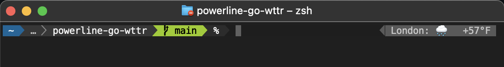

# powerline-go-wttr

A quick program to put the weather on your [powerline-go](https://github.com/justjanne/powerline-go) prompt using [wttr.in](https://wttr.in).

## Usage

- Install this application into your PATH.
  - `go install github.com/chrissexton/powerline-go-wttr@latest`
- Add necessary variables to your terminal environment along with your powerline-go configuration.
- Add `wttr` to your list of modules in the powerline-go configuration.

### Flags

`wttr -help`

### Environment Variables

- `WTTR_LOCATION`: required airport, zip, or city name
- `WTTR_FORMAT`: optional wttr.in format string (default: %l:+%c+%f)
- `WTTR_TIMEOUT`: go duration for cache invalidation (default: 5m)
- `WTTR_CACHE`: location for cache (default: /Users/cws/.wttr_cache)

## Is it good?

It's fine. It's all fine.
